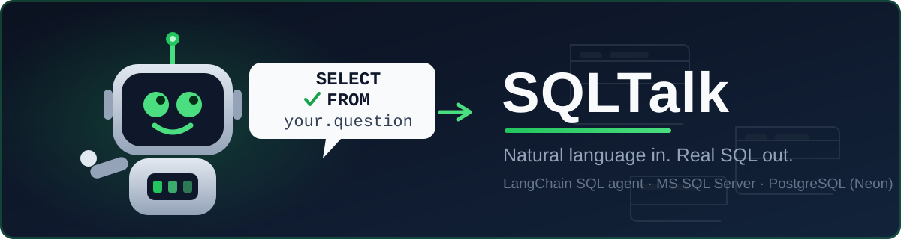

<div align="center">



# SQLTalk

**Natural-language interface for your database.**

Ask a question in plain English — get a real answer computed from your live database.

[](#license)
[](https://www.python.org/)
[](https://streamlit.io/)
[](https://www.langchain.com/)
[](https://neon.tech)
[](https://www.microsoft.com/en-us/sql-server)
[](#contributing)
[](#reporting-an-issue)

</div>

---

SQLTalk turns a question into SQL, runs it against the database, and explains
the result back to you in words. Developed against **Microsoft SQL Server**
(T-SQL + AdventureWorks) and deployed as a free public demo on
**PostgreSQL (Neon)** + **Streamlit Community Cloud**.

```
Natural-language question
        │
        ▼
 LLM reasons about schema (multi-provider fallback chain)
        │
        ▼
   SQL generated (T-SQL or PostgreSQL, per the active dialect)
        │
        ▼
  Executed on SQL Server / Postgres
        │
        ▼
  Rows / aggregates returned
        │
        ▼
 LLM interprets the result
        │
        ▼
 Human-readable answer
```

Built by **Ahmed Shili** — [GitHub](https://github.com/ahmshili) ·
[Portfolio](https://ashili.pages.dev)

## Features

- Natural-language querying of a **Microsoft SQL Server** or **PostgreSQL**
  database (dialect selected via `DB_DIALECT`; row limits and the
  query-checker prompt adapt automatically)
- Automatic SQL generation, execution, and result interpretation
- Conversational follow-ups (no need to repeat table/column names)
- **Multi-provider LLM fallback, ordered by inference speed** — Groq
  (default, fastest) → Gemini → OpenRouter. One complete SQL agent is built
  per provider/key and fallback happens at the agent-invocation level
- **Query transparency by default** — the generated SQL, raw results, and
  execution details are shown under every answer (one toggle to hide them)
- **Automatic health checks** — the database and the model layer are
  verified on page load, so visitors see a real status, never "Not tested"
- Read-only safety mode by default, with a configurable row cap
- Modern, minimal Streamlit UI with live connection status
- Small, focused test suite covering config, safety, database, and agent wiring

## Architecture

```
sqltalk/
├── app.py                  # entrypoint (streamlit run app.py)
├── seed_postgres_demo.py   # seeds the free Neon demo dataset
├── assets/                 # banner + mascot (SVG)
├── app/
│   ├── config/settings.py  # env loading & validation (dialect, providers, order)
│   ├── llm/provider.py     # Groq / Gemini / OpenRouter factories
│   ├── database/
│   │   ├── uri.py          # dialect-aware connection-string builder
│   │   ├── connection.py   # SQLDatabase wrapper, connection testing
│   │   ├── multi_schema.py # multi-schema reflection (MSSQL + Postgres)
│   │   └── safety.py       # read-only guard, row-limit enforcement
│   ├── agent/
│   │   ├── toolkit.py      # guarded SQL tools (safety + transparency hooks)
│   │   ├── executor.py     # ReAct SQL agent construction
│   │   └── fallback.py     # per-provider agent chain, invocation-level fallback
│   └── ui/
│       ├── main.py         # Streamlit page orchestration
│       ├── sidebar.py      # DB / LLM status / agent / about panels
│       ├── chat.py         # chat rendering + transparency panels
│       └── theme.py        # CSS + empty-state copy
├── tests/
└── .env.example
```

Each layer only depends on the one below it: the UI never touches
SQLAlchemy directly, the agent never touches Streamlit, and the LLM layer
knows nothing about SQL.

## Requirements

- Python 3.10+
- A database: **Microsoft SQL Server 2019+** (developed against SQL Server
  2022 Developer Edition, `AdventureWorks2022`) — or a **PostgreSQL**
  instance such as the free [Neon](https://neon.tech) tier
- [ODBC Driver 18 for SQL Server](https://learn.microsoft.com/en-us/sql/connect/odbc/download-odbc-driver-for-sql-server)
  (MSSQL only)
- An LLM API key — one of
  [Groq](https://console.groq.com/keys) (free, recommended),
  [Google AI Studio](https://aistudio.google.com/app/apikey), or
  [OpenRouter](https://openrouter.ai) (free tier works)

## Installation

### Windows (PowerShell)

```powershell
git clone https://github.com/ahmshili/sqltalk.git
cd sqltalk

python -m venv .venv
.\.venv\Scripts\activate

pip install -r requirements.txt

copy .env.example .env
notepad .env   # fill in DB_CONNECTION_STRING and an API key
```

### macOS / Linux

```bash
git clone https://github.com/ahmshili/sqltalk.git
cd sqltalk

python3 -m venv .venv
source .venv/bin/activate

pip install -r requirements.txt

cp .env.example .env
# then edit .env: fill in DB_CONNECTION_STRING and an API key
```

## Running

```powershell
# Windows
.\.venv\Scripts\activate
streamlit run app.py
```

```bash
# macOS / Linux
source .venv/bin/activate
streamlit run app.py
```

Then open the printed local URL (typically `http://localhost:8501`).

## Configuration

Copy `.env.example` to `.env` and fill it in — every variable is documented
by comments in that file. The essentials:

| Variable                 | Required | Default        | Notes                                                |
|---------------------------|:--------:|----------------|------------------------------------------------------|
| `DB_DIALECT`              |          | `mssql`        | `mssql` (SQL Server) or `postgres` (Neon demo)       |
| `DB_CONNECTION_STRING`    | ✅       | —              | SQLAlchemy URI — or the `DB_*` parts form            |
| `GROQ_API_KEY`            | ✅*      | —              | *One provider key is required                        |
| `GEMINI_API_KEY`          |          | —              | Second in the fallback chain                         |
| `OPENROUTER_API_KEY`      |          | —              | Third in the fallback chain                          |
| `GROQ_MODEL`              |          | *(provider default)* | Model slugs are commented in `.env.example`     |
| `READ_ONLY_MODE`          |          | `true`         | Blocks DROP/DELETE/TRUNCATE/ALTER/INSERT/UPDATE/etc. |
| `DEV_MODE`                |          | *(off)*        | `true` enables the session-only developer sidebar    |

## Example questions

Example prompts also stay available during a session via the persistent
"💡 Example questions" strip below the chat transcript — not just on the
empty state.

- How many products are in the database?
- Show me the 5 most expensive products.
- Which products have never been sold?
- Which customers placed the most orders?
- What are the top 10 products by total sales?
- How much revenue did each year generate?
- Which sales territory generated the most revenue?
- Compare sales between 2012 and 2013.
- Which customers have never placed an order?

## Tests

```powershell
pytest
```

Covers: required-configuration validation, provider-order resolution and
normalization, read-only/keyword safety checks, row-limit enforcement (both
dialects), database connection creation and error wrapping, provider spec
collection and ordering, the LLM health check, and agent/toolkit/fallback
wiring (LLM and DB layers are mocked — no live database or API key needed
to run the suite).

## Contributing

Bug reports and pull requests are welcome — **in this repository** (the
project is published under a restricted evaluation license; see
[License](#license)). Please run `pytest` before opening a PR, and add
tests for any new behavior.

Questions? Open a GitHub issue.

## Reporting an issue

Found a bug, or an idea that would make this stronger? Please open a GitHub
Issue in **this repository**:

1. Go to [github.com/ahmshili/sqltalk/issues](https://github.com/ahmshili/sqltalk/issues)
2. Click **New issue** and pick the bug-report form
3. Describe what you did, what you expected, and what happened

**Please redact secrets** — never paste API keys, connection strings, or
passwords into an issue. A sanitized error message and your `DB_DIALECT` /
Python version are usually enough to reproduce.

## License

See [`LICENSE`](./LICENSE). This project is shared under a **restricted
evaluation license**, published for the express purpose of **evaluation and
review by recruiters, hiring teams, and technical reviewers**:

- ✅ **Permitted:** running it locally to evaluate it, reading and reviewing
  the code, and submitting pull requests or bug reports **to this
  repository**
- ❌ **Not permitted:** forking, redistributing, or re-publishing the code
  anywhere else, or any commercial use, without prior written permission

The code stays in this repository — the value of the project is in the
review and the conversation around it, not in copies of it.
